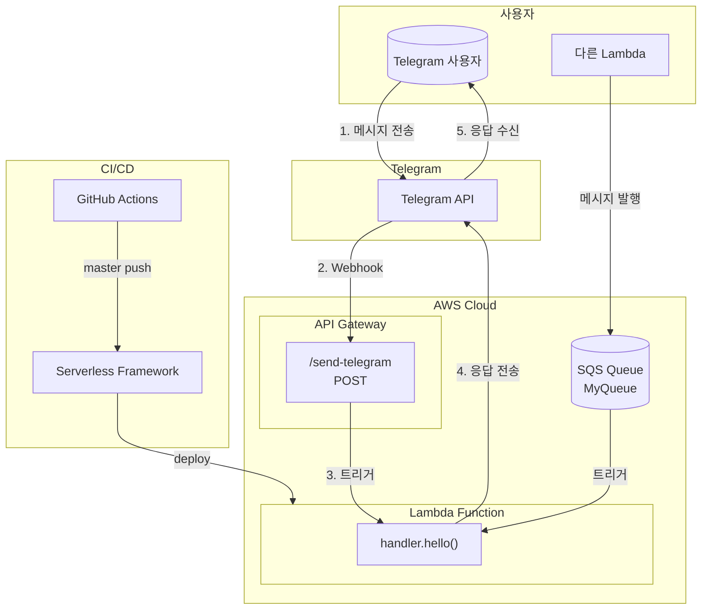

# my-telegram-bot
Personal telegram bot lambda

## Architecture

## 주요 구성요소

| 구성요소 | 설명 |
|---------|------|
| **Telegram API** | 봇 메시지 수신/발신 |
| **API Gateway** | HTTP POST 엔드포인트 제공 |
| **Lambda** | Python 3.6 핸들러 (handler.hello) |
| **SQS** | 비동기 메시지 큐 (다른 Lambda 연동용) |
| **GitHub Actions** | master 브랜치 push 시 자동 배포 |

## 메시지 흐름

1. **직접 메시지**: Telegram → Webhook → API Gateway → Lambda → Telegram 응답
2. **SQS 메시지**: 다른 Lambda → SQS → Lambda → Telegram 전송
